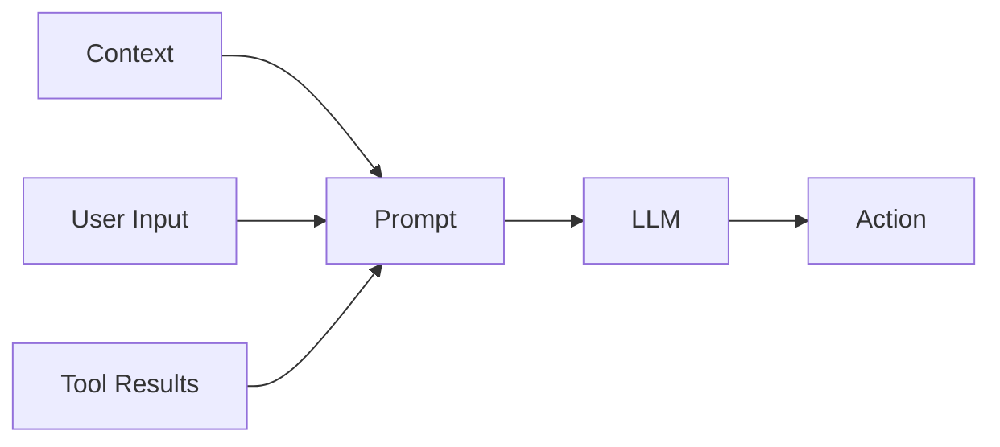
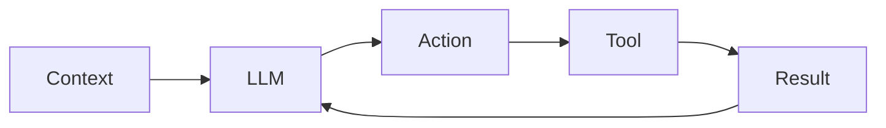
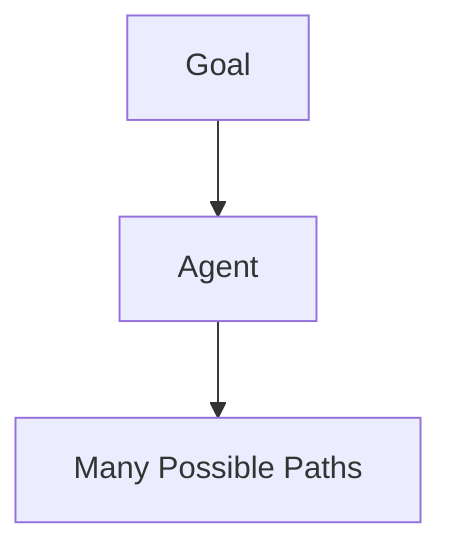
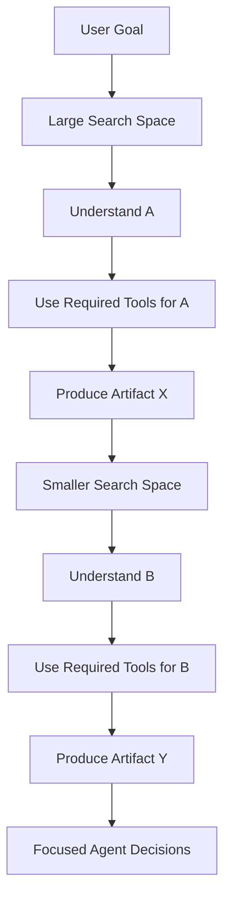

## Disclaimer

These are my personal observations and opinions.

## Background

Through my work on an AI agent building project, I have found myself observing an interesting pattern in the rapidly evolving field of agent engineering. The goal of this project is to evolve a general-purpose coding agent into a domain-specific coding assistant, one that can leverage specialized knowledge to better support users in a particular context.

While developing this system, I have witnessed countless debates and competing narratives: building with LangChain versus building from scratch, workflows versus agents, skills versus MCP, CLI versus MCP, and using more tokens versus optimizing token consumption.

A lot of agent engineering discourse is written in the language of replacement: X replaces Y, this abstraction makes that abstraction obsolete, and the newest pattern finally solves what the previous one could not.

I find that story too neat. In practice, these ideas rarely replace each other cleanly. They coexist, overlap, and get recombined. Agent engineering is still searching for the right balance between flexibility and structure.

## You Can't Make Bricks Without Straw (巧妇难为无米之炊): What Is an Agent?

Before discussing how to engineer agents, I think it is worth taking a step back and asking a more fundamental question: what exactly makes a system an agent?

From my perspective, an agent is not defined by the number of components it contains. Memory, planning, reflection, skills, workflows, and other emerging patterns are valuable engineering approaches, but they are not the essence of an agent. This is not intended to be a formal definition. It is a minimal engineering abstraction that helps me reason about how agent systems are constructed.

If we strip away the surrounding abstractions, the foundation is surprisingly simple:

> **Agent = LLM + Context + Actions**

An agent is a system where an LLM can reason based on available context and take actions that influence the outcome. Memory is a mechanism for managing context. Planning is a mechanism for organizing actions. Tools are mechanisms for expanding available actions. Workflows are mechanisms for structuring the environment in which actions take place.

The interesting question is not whether these components exist. The interesting question is how we design the system around this minimal foundation.

## The Two Fundamental Ingredients: Prompts and Code

If an agent is built around an LLM, context, and actions, how do we actually shape its behavior? My current view is that prompts and code are the two fundamental ingredients used to construct an agent system. They are not competing alternatives. They operate at different layers.

Prompts shape the interaction between information and intelligence. Code shapes the system surrounding that intelligence. Most agent engineering concepts I have encountered can be understood as different ways of combining these two ingredients.

### Prompt: The Input Layer of Agent Behavior

When people talk about prompts, they often refer to a piece of text written by a human. In agent engineering, I find this definition too narrow. A prompt is not simply an instruction; it is the complete input provided to an LLM at a given moment.

For text-based models, this may primarily consist of text. For multimodal models, it may include images, audio, or other forms of information. Ultimately, anything that enters the model's context window and influences its next decision is part of the prompt.

In the project I worked on, the user's prompt was only one part of what the model actually received. To turn a general-purpose coding agent into a domain-specific assistant, we provided additional background knowledge, behavioral guardrails, MCP tool definitions and schemas, skills, and predefined parameterized prompts. Some of these looked like instructions, some looked like capabilities, and some looked like product features.

From the model's perspective, they all shaped the same thing: the context in which the next decision was made. This is why I find the narrow definition of prompt misleading in agent systems. The important engineering question is not only what the user says, but what the system chooses to place around that request.

A prompt in an agent system usually comes from several sources:

#### Context: What the Agent Knows

Context defines the world that the LLM operates within. It may include the task description, role definition, background knowledge, retrieved information, conversation history, and environment state.

Many emerging concepts in agent engineering are fundamentally about context engineering. Memory, for example, is not necessarily a new cognitive capability. At its core, memory is a mechanism for deciding what information should be stored, what information should be retrieved, and what information should become part of the current context.

Similarly, Retrieval-Augmented Generation (RAG) does not fundamentally change the model's intelligence. It changes the information available to the model. In this sense, memory and RAG are different approaches to managing context.

#### User Input: Structured Intent

User input is another important source of prompts. As agents evolve, users no longer interact only through natural language. Modern systems introduce structured interfaces such as shortcut commands, @ mentions, skills, and predefined actions. These mechanisms transform human intent into structured inputs that guide the model.

Skills are a good example. A skill may appear to be a new capability added to an agent, but at its core it is usually a combination of instructions, examples, constraints, and available actions. A skill is not a new primitive. It is a structured way of constructing prompts and exposing capabilities.

#### Tool Results: The Dynamic Context

Agents differ from traditional language applications because they can interact with external environments. However, the action itself is only part of the loop. The result of an action becomes the next input to the model.

The agent continuously operates through:

> Think -> Act -> Observe -> Think

Tool results are therefore not separate from prompts. They are dynamically generated context.

### Code: The System Layer

If prompts define what the model sees, code defines the environment in which the model operates. Code is responsible for building the mechanisms that surround intelligence: context management, action execution, agent orchestration, workflow design, validation, and error handling.

Code does not replace reasoning. It creates the structure that allows reasoning to become useful.

#### Context Management

Although context belongs to the prompt, managing context is a code problem. The system needs to decide what information enters the context window, how information is prioritized, when information is summarized, and when irrelevant information is removed.

The LLM consumes context. Code assembles and manages it.

#### Workflow: Providing a Well-Defined Path

Workflow is often discussed as the opposite of autonomous agents. I think this framing is misleading. A workflow does not necessarily reduce an agent's intelligence; it provides structure around the agent.

This was close to the problem we faced in our own project. We wanted to build a coding assistant for a specific domain. If we used a bare agent directly, the agent had to infer the programmer's intent, discover the relevant environment information, and decide where to start, all at the same time.

The problem was not that the agent was incapable. The problem was that the search space was too large. One run might start from reading configuration files. Another might inspect APIs first. Another might jump directly into implementation. The final answer could still look plausible, but the process was hard to control and hard to measure.

By abstracting the workflow of domain programmers, we gave the agent a more stable path. Each state represented a stage of understanding or information gathering. Some MCP tools were required before the agent could move to the next state. The agent still reasoned within each stage, but it followed a consistent structure for understanding the task and collecting the right context.

For example, when writing domain-specific code, a bare agent may begin from many possible places: reading configuration, inspecting APIs, searching for examples, or implementing directly. With a workflow, the process becomes more explicit. The agent first understands A, uses the required tools for that stage, and produces artifact X. It then understands B, uses another set of tools, and produces artifact Y. The exact content of A, B, X, and Y depends on the domain, but the shape of the work is defined.

The instructions were also data-driven. Different environments or requirements could trigger different instructions, allowing the workflow to adapt without turning the entire system into an unbounded open-ended agent.

Without a workflow, an agent faces a larger exploration space:

With a workflow:

The workflow provides a predefined path: what stages exist, what objectives each stage should achieve, what information is relevant, what tools are required, and what artifacts should be produced. Each stage narrows the search space before the agent makes the next decision. The agent still reasons and makes decisions within each step, but it no longer has to rediscover the entire problem shape from scratch.

A useful analogy is a path-finding robot. A robot without any prior information may repeatedly explore inefficient paths and encounter obstacles. A robot with a map does not become less intelligent; the environment becomes more structured, allowing it to focus its capability on meaningful decisions.

Similarly, a workflow does not tell an agent what answer to produce. It tells an agent where to look for the answer. Workflow is not about replacing intelligence. It is about reducing unnecessary exploration. In this sense, workflow is not the opposite of agency. It is a way of deciding where agency is allowed to happen.

#### Agent Orchestration

As systems become more complex, code also determines how multiple capabilities work together. Routing tasks to different agents, managing handoffs, coordinating tools, and maintaining state are orchestration patterns implemented through code. Multi-agent systems are therefore not simply multiple LLMs.

## The Boundary Between Prompts and Code

The most interesting engineering decisions are not about choosing prompts or code. They are about deciding where each belongs. Prompt determines the information and instructions available to the model; code determines the environment and mechanisms surrounding the model.

My rule of thumb is simple:

> If a behavior benefits from interpretation, adaptation, and judgment, it can often live in prompts. If a behavior requires enforcement, repeatability, observability, or safety, it should usually move into code.

A style preference can be prompt, while a permission boundary should be code. A workflow hint can be prompt, while a required transition condition should be code. A memory summary may become prompt content, but the policy deciding what gets remembered is code.

This boundary is not always clean. Many useful agent features sit across both sides. Skills may expose instructions to the model while also relying on code to decide when they are loaded. MCP tools may appear to the model as definitions and schemas, but their execution, permissions, and returned results are handled by the system around the model. Workflows may provide instructions inside each stage, while code enforces which stages exist and how the agent moves between them.

The challenge is not to maximize autonomy or maximize control. The challenge is to design an environment where an agent can reason effectively.

## Prompts and Code as the Salt and Pepper of Agent Engineering

Agent engineering is evolving rapidly. New concepts will continue to emerge. Some will become important abstractions, and some will eventually disappear. However, many of these concepts are not new ingredients. They are new recipes.

Memory, planning, skills, workflows, MCP, and multi-agent systems are different ways of combining the same fundamental elements: prompts and code.

Just as salt and pepper do not define a dish, but influence almost every dish they touch, prompts and code do not define an agent by themselves. They are the fundamental ingredients that shape how an agent perceives, reasons, and acts.
