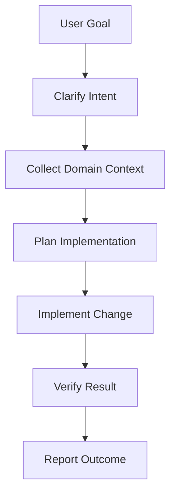
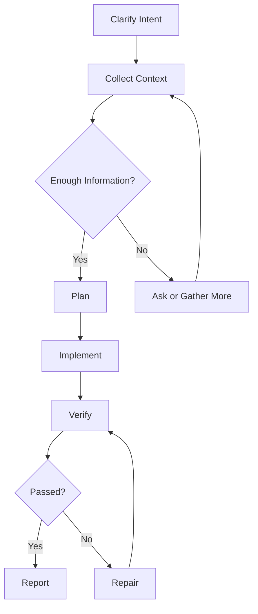

## Disclaimer

These are my personal observations and opinions.

## Background

In my previous post, I described prompts and code as the two fundamental ingredients of agent engineering. Prompts shape what the model sees. Code shapes the environment in which the model acts.

This post is about one of the places where that boundary becomes especially important: workflow design.

When people discuss agents, workflows are sometimes framed as the opposite of agency. The story usually sounds like this: a workflow is deterministic, rigid, and old-fashioned, while an agent is flexible, autonomous, and intelligent. In this framing, adding a workflow means taking freedom away from the agent.

I think this framing is misleading.

In practice, the question is not whether an agent should have freedom. The question is where that freedom should exist. A workflow does not need to tell an agent what answer to produce. A good workflow defines the shape of the environment so that the agent can apply its reasoning in the right places.

This became clear to me while working on a project that aimed to evolve a general-purpose coding agent into a domain-specific coding assistant. The base coding agent was already capable. It could inspect files, reason about code, call tools, edit implementation, and summarize the result. However, once the task moved into a specific domain, capability alone was not enough.

The agent did not only need to solve the programming problem. It first needed to understand the domain context, identify the relevant environment information, discover which tools mattered, follow project-specific conventions, and decide when it had enough evidence to begin implementation.

Without a workflow, all of those decisions were left to the agent at once.

Sometimes it started by reading configuration files. Sometimes it searched for examples. Sometimes it jumped directly into implementation. Sometimes it asked for clarification too early. Sometimes it gathered useful context but failed to preserve it in a form that later steps could rely on.

The final answers could still look reasonable, but the process was hard to control, hard to observe, and hard to evaluate.

That is where workflow design became necessary.

Recent ideas such as loop engineering, dynamic workflows, spec-driven development, and skill systems all point to a similar need: agents perform better when structure is designed, not rediscovered in every conversation.

They place that structure in different places. Loop engineering focuses on feedback cycles. Claude Code's Dynamic Workflows move orchestration into executable scripts. Spec-driven development turns vague intent into persistent artifacts such as specifications, plans, tasks, and checkpoints. Skill systems such as Superpowers and grill-me package reusable professional habits into agent-visible instructions.

The question I care about is more specific:

> Who owns the structure of the loop?

If the structure lives only in the agent's prompt, it remains mostly behavioral guidance. If it lives in an external workflow layer, such as MCP, it can become stateful, observable, and enforceable.

This post focuses on a related design question from my own project: how those loops can become engineerable workflows in a domain-specific agent system, and why we chose MCP as the layer that owns that structure.

## What I Mean by Workflow

Before explaining why workflows are useful, I should define what I mean by workflow in this post.

I do not mean a mechanical sequence of steps, like:

1. Open the refrigerator door.
2. Put the elephant into the refrigerator.
3. Close the refrigerator door.

That kind of workflow assumes the task is already fully specified and the execution path is obvious. The system only needs to call the right actions in the right order.

If the steps are truly deterministic, we probably do not need an agent at all. A script can execute the task more precisely, cheaply, and reliably.

Agent workflows are different.

The problems I care about are still open-ended. The user may describe the goal in natural language. The data, codebase, tools, constraints, and edge cases may vary from task to task. The agent still needs to reason at every stage.

However, the way to handle the problem can often be abstracted into a path.

For example, imagine a domain-specific coding assistant helping a user create an industry-standard summary table using SQL or another programming language. The exact request may vary: common cases may follow the expected pattern, while uncommon cases may require more careful interpretation of tables, metrics, conventions, validation rules, and reporting requirements.

Still, an experienced programmer in that domain would usually follow a recognizable order:

- Understand the reporting goal.
- Inspect the relevant data model or source tables.
- Identify the required metrics, dimensions, and filters.
- Check domain conventions and industry standards.
- Draft the query or transformation.
- Validate the output shape and edge cases.
- Explain the result and any assumptions.

The programmer is not mechanically executing a fixed script. They are thinking within a familiar path.

That is the sense in which I use workflow here:

> A workflow is a defined path for handling a class of open-ended problems.

It gives the agent a reasoning framework. At each stage, the agent receives stage-specific instructions, available tools, and expected artifacts. The agent still decides what matters, which tool result is relevant, whether the evidence is sufficient, and how to move the task forward.

In other words, workflow is not the removal of reasoning. It is a structure for reasoning.

## Why Design a Workflow?

The first reason to design a workflow is simple: open-ended agent behavior has a large search space.

A coding agent does not only choose what code to write. It also chooses what to inspect, what to ignore, which tools to call, which assumptions to make, and when to stop gathering information. For a general-purpose coding task, this flexibility can be useful. For a domain-specific task, it can also become expensive and unstable.

If the agent must discover the problem shape from scratch every time, it spends too much reasoning effort on orientation. It has to answer several questions before it can even begin solving the user request:

- What stage of work am I in?
- What information is required for this stage?
- Which tools should I call?
- Which tool calls are optional, and which are required?
- What artifact should I produce before moving on?
- What counts as enough context?
- What should happen if the evidence is incomplete?

These are not always questions the agent should be forced to rediscover. In many domains, experienced human programmers already follow a rough path. They clarify intent, inspect the environment, look for relevant APIs or examples, understand constraints, propose a plan, implement, verify, and report the result.

The exact content changes from task to task, but the shape of the work is often stable.

A workflow captures that stable shape.

### Workflow Reduces Unnecessary Exploration

An agent without workflow can choose many paths: reading files, searching examples, calling domain tools, implementing directly, asking for clarification, or running verification. This freedom is not always bad. The problem is that the agent may spend too much effort deciding where to begin. Worse, two runs of the same task may follow very different paths, making the system difficult to debug.

With a workflow, the system narrows the search space before each decision:



The workflow does not decide the final answer. It decides which kind of work should happen next.

A useful way to say this is:

> A workflow does not tell the agent what to think. It provides a path for how thinking should proceed.

This is the key distinction. A workflow is valuable because it provides a reasoning framework. It reduces unnecessary exploration and leaves the agent to reason within a more meaningful boundary.

### Workflow Makes Behavior Observable

Another reason to design workflows is observability.

When an agent operates as one large open-ended loop, the main observable output is the final response. If the result is wrong, it can be difficult to know why. Did the agent misunderstand the user's intent? Did it fail to inspect the right files? Did it call the wrong tool? Did it gather the right information but forget it later? Did it skip verification?

A workflow turns the agent process into a sequence of inspectable stages.

Instead of asking only whether the final answer was good, we can ask:

- Did the agent complete the intent clarification stage?
- Did it collect the required domain context?
- Did it produce a usable intermediate artifact?
- Did it call the tools required for this stage?
- Did it move to implementation too early?
- Did verification fail because of the implementation or because of the test environment?

This matters because agent engineering is not only about getting a good answer once. It is about building a system whose behavior can be improved over time.

Workflow gives us places to observe, measure, and debug.

### Workflow Creates Stable Interfaces Between Steps

Long-running agent tasks often suffer from context drift. The agent may gather useful information early, but later parts of the conversation become crowded with tool results, partial plans, error messages, and revisions. Important context can become buried.

Workflow helps by creating intermediate artifacts.

For example:

- An intent summary records what the user wants.
- An environment summary records what the agent has learned about the project.
- An API candidate list records relevant domain interfaces.
- An implementation plan records the chosen approach.
- A verification result records what was tested and what happened.

These artifacts are not just notes. They are stable interfaces between stages. They compress context, make progress explicit, and give later stages something reliable to depend on.

Workflow transforms a long, fragile conversation into a sequence of smaller reasoning problems connected by structured state.

## How to Design a Workflow

A workflow should not begin with the question, "How should the agent think?"

It should begin with a more grounded question:

> How does a competent human usually approach this kind of task?

In a domain-specific coding assistant, the goal is not to invent an artificial process for the model. The goal is to abstract the process that domain programmers already use, then turn that process into stages, tools, artifacts, and transition rules.

### Start From the Human Workflow

For a coding task, a human workflow might look like this:

1. Understand the user's intent.
2. Inspect the project environment.
3. Locate relevant domain APIs, conventions, or examples.
4. Identify constraints and risks.
5. Decide an implementation approach.
6. Make the change.
7. Verify the result.
8. Explain what changed.

This does not mean every task must follow the same exact path. Small tasks may skip some stages. Failed verification may send the agent back to implementation. Missing context may require clarification. But the high-level structure gives the system a map.

The workflow should capture the recurring shape of the work, not every possible detail.

### Define Stages, Not Scripts

A workflow stage should not be a script that tells the agent every sentence to say or every internal thought to have. That would be brittle and unnecessary.

Instead, each stage should define three things:

```text
What should the agent understand here?
What actions are available or required?
What artifact should this stage produce?
```

For example:

```text
Stage: Domain Context Collection
Goal: Understand the domain-specific information needed for this task.
Required actions: Query domain metadata, inspect relevant examples, retrieve project conventions.
Output artifact: A concise domain context summary.
```

This gives the agent a clear objective while preserving room for judgment. The agent can still decide which example matters, how to interpret the metadata, and what risks are worth mentioning.

The workflow defines the boundary. The agent reasons inside the boundary.

### Separate Guidance From Enforcement

One of the most important workflow design questions is where a rule should live.

Some rules are soft guidance. They shape behavior but do not need strict enforcement. For example:

- Prefer minimal changes.
- Explain assumptions clearly.
- Keep the final answer concise.
- Use examples when they clarify the design.

These can often live in prompts or skills.

Other rules are hard constraints. They should be enforced by code or workflow state. For example:

- The agent cannot enter implementation before required domain context is collected.
- A stage cannot be marked complete without producing its required artifact.
- A verification stage must store the command and result.
- A transition should fail if required tool calls have not happened.

These should not depend only on the model remembering and obeying an instruction.

My rule of thumb is:

> Put judgment in prompts. Put enforcement in code.

This does not mean prompts are weak or code is always better. It means they are good at different things. Prompts are good at interpretation, adaptation, and judgment. Code is good at enforcement, repeatability, observability, and safety.

Workflow design sits exactly at this boundary.

### Use Artifacts as State, Not Decoration

In many agent prototypes, intermediate summaries are treated as nice-to-have explanations. In a workflow, they should be treated as state.

An artifact should be useful to the next stage. If the implementation stage depends on the domain context stage, then the output of the domain context stage should be structured enough to guide implementation.

For example, a weak artifact might say:

```text
The project uses several domain-specific APIs. The agent should be careful.
```

A stronger artifact might say:

```text
Relevant APIs:
- Tool A: used to retrieve project metadata.
- Tool B: used to validate generated configuration.

Constraints:
- Generated files must follow naming convention X.
- Implementation should not modify runtime-owned files.

Open questions:
- No example was found for case Y.
```

The second artifact is not merely more verbose. It is more operational. It gives later stages something to use.

Good workflow artifacts should be compact, specific, and connected to future decisions.

### Keep the Workflow Adaptive

A workflow should be structured, not rigid.

Rigid workflows fail because real tasks do not always arrive in the same shape. Some tasks are small. Some are ambiguous. Some have missing information. Some fail during verification and need a retry loop. Some should stop early because the requested change is unsafe or impossible.

An adaptive workflow can include branches:



This kind of structure does not make the agent less flexible. It makes flexibility explicit. The agent can still adapt, but adaptation happens through visible transitions instead of hidden improvisation.

## Why Not an Agent Skill-Driven Workflow?

Once we decided that workflow mattered, the next question was where the workflow should live.

One option was an agent skill-driven workflow: a workflow primarily expressed as instructions visible to the agent. A skill might tell the agent when to use the workflow, what stages to follow, which tools to call, what artifacts to produce, and how to decide whether the task is complete.

This approach has real strengths. It is lightweight, easy to iterate, and fits naturally with model reasoning. For exploratory or advisory processes, this can work well.

Skills are especially useful when the workflow is mostly guidance.

For example, a skill can say:

- When editing a document, inspect the existing style first.
- When debugging, reproduce the issue before changing code.
- When writing a summary, preserve the user's terminology.
- When using a tool, explain the relevant result.

These instructions shape the agent's behavior without requiring a separate state machine.

However, for our use case, the workflow needed to be more than guidance.

### Instruction Alone Is Not Enforcement

The main limitation of a purely instruction-driven workflow is that the workflow still depends heavily on the agent following instructions.

The skill can tell the agent to complete stage A before stage B, but the runtime may not actually prevent the agent from skipping ahead. It can tell the agent to call a required tool, but the requirement is often behavioral rather than structural. It can tell the agent to produce an artifact, but the artifact may not be validated or stored in a reliable external state.

That said, this is not a clean split between skills and code. Some skill packages include scripts that perform local checks, validate files, run commands, or enforce parts of a process. In those cases, the skill is no longer only prompt text. It becomes a small package of instructions plus executable support.

This leads to several practical problems:

- The agent may skip a stage when the conversation becomes long.
- The agent may believe a stage is complete when required evidence is missing.
- The agent may call tools in an inconsistent order.
- The workflow state may exist only in the model's context unless it is stored by a script, tool, or external system.
- It may be difficult for the system to know which stage failed.
- Evaluation may depend on reading the final transcript rather than inspecting structured state.

This is not a criticism of skills as a concept. It is a question of responsibility.

Skills are good at shaping behavior. Scripts can add local enforcement. MCP can provide a shared external layer for state, tools, integration, and transition control.

For our project, enforcement, observability, and integration mattered enough that we did not want the workflow to live only inside agent-visible instructions.

This was especially true because the target environment was an enterprise environment. The workflow was not only a personal productivity habit. It had to connect with internal systems, respect permission boundaries, call domain-specific tools, preserve intermediate artifacts, and support later debugging or evaluation. In that setting, a workflow is closer to product infrastructure than a reusable prompt.

## Why We Chose an MCP-Driven Workflow

The alternative was to make the workflow MCP-driven.

By "MCP-driven workflow," I mean that the workflow state, stage transitions, required actions, and artifacts are managed by an MCP server or external system rather than only by the agent's prompt.

In this design, the agent still reasons and acts. But the system around the agent controls the workflow structure.

The MCP server can expose the current stage, return stage-specific instructions or context, provide the tools available at that stage, store artifacts, validate transition conditions, and reject invalid state changes.

The agent does not need to hold the entire workflow in its prompt at all times. It can ask the MCP server what is relevant now.

The short version is:

> We chose MCP not because skills are weak, but because the workflow needed to become enterprise infrastructure.

### Enforcement Layer

The first reason we chose an MCP-driven workflow was not that MCP is the only way to enforce behavior. It was that we needed an enforcement layer outside the model's context.

If a stage requires domain context collection, the MCP layer can make that requirement explicit. It can track whether the required tool has been called, check whether the required artifact exists, and prevent transition into implementation until the stage is complete.

This is different from asking the model to remember a rule.

The model still makes judgments, but the workflow does not depend entirely on those judgments for structural correctness.

Even then, MCP does not eliminate the need for scripts. Because our MCP server is remote, some checks and information gathering still need to happen close to the user's environment: inspecting local files, running local commands, checking generated artifacts, or preparing data for a remote tool call. In practice, the system is layered. Local scripts can act as harnesses, while MCP owns the shared workflow state and enterprise-facing integration.

### Observability

The second reason was observability.

When workflow state lives outside the model, it can be logged, inspected, measured, and evaluated. We can know which stage the agent is in, what actions have occurred, which artifacts were produced, and where failure happened.

This makes the agent system easier to debug.

Instead of only asking, "Was the final answer good?", we can ask:

- Did the domain context stage produce useful context?
- Did the planning stage use that context?
- Did implementation follow the plan?
- Did verification fail because of bad code, missing environment setup, or an invalid assumption?

The workflow becomes a system-level object, not just a transcript pattern.

### Context Control

The third reason was context control.

If the entire workflow is written into a skill, the agent may receive a large amount of instruction up front. Some of that instruction may not be relevant to the current stage. As the task grows, the context window becomes crowded with user messages, tool outputs, code snippets, plans, errors, and workflow guidance.

An MCP-driven workflow can return stage-specific context.

The agent does not need every instruction all the time. It needs the right instruction at the right moment.

This is especially useful for domain-specific coding assistants, where each stage may require different domain knowledge, different tools, and different validation rules.

### Enterprise Integration

Another reason was enterprise integration.

In a personal coding setup, a workflow can often live as a skill, a local script, or a set of project conventions. In an enterprise setting, the workflow usually needs to cross system boundaries: internal metadata, domain documentation, permissions, standardized templates, validation services, and internal platforms.

MCP was a better fit because it gave us a controlled integration layer. The agent could interact with enterprise systems through explicit tools, while the MCP layer decided what the agent was allowed to see, what it could call, and how tool results should be returned.

This also changed how we thought about safety. Some workflow rules are organizational constraints, not preferences: use approved data definitions, avoid restricted resources, or validate generated output against internal standards. Those rules should not depend only on whether the model remembers a sentence in a skill.

### Reusability Across Agents

Another reason was reusability.

If the workflow lives only inside an agent skill, it is closely tied to one agent runtime. If the workflow lives behind MCP, different clients and agents can reuse the same workflow logic.

This matters because domain workflows often represent product or platform knowledge, not only agent behavior. They may need to be shared across interfaces, evaluated independently, or evolved without rewriting each agent's prompt package.

Putting workflow logic in MCP made it easier to treat the workflow as infrastructure.

### Separation of Responsibilities

The final reason was separation of responsibilities.

The cleanest mental model for us became:

```text
Skill / Prompt:
- How the agent should reason within a stage
- What style or strategy it should prefer
- How to interpret ambiguous information

MCP / Code:
- What stages exist
- What tools are available or required
- What artifacts must be produced
- When a transition is allowed
- How workflow state is stored and observed
```

This mirrors the broader boundary between prompts and code.

Prompts guide reasoning. Code manages the environment.

MCP gave us a way to put workflow where it belonged: in the environment around the agent, while still allowing the agent to reason inside each stage.

## Skills Still Matter

Choosing an MCP-driven workflow does not mean skills are useless.

In fact, skills and MCP can complement each other well.

A skill can teach the agent how to behave within a stage. It can provide domain heuristics, examples, style preferences, and reasoning strategies. MCP can manage state, tools, transitions, and artifacts.

The difference is not "skills versus MCP" in general. The difference is what kind of workflow we need.

Another way to think about the choice is problem maturity.

If the problem is still poorly understood, or if the general solution is not yet clear, it is often better to keep the structure closer to skills and prompts. Skills can encode a thinking framework, a questioning strategy, or a set of professional habits without pretending that the process is fully known.

If the problem is well understood, and the organization has accumulated experience about how it should usually be solved, then the workflow can move closer to code. At that point, the path is not arbitrary. It reflects past practice, domain knowledge, known failure modes, and a shared understanding of what good work looks like.

A useful rule of thumb is:

> Use skills when the workflow is mostly guidance. Add scripts when the workflow needs local checks or executable support. Use MCP when the workflow needs shared state, observability, enterprise integration, and enforceable system boundaries.

For our project, the workflow needed to be a system property, not only a behavioral suggestion. That is why we chose an MCP-driven workflow.

This also suggests a broader way to think about skills.

Skills are not all the same kind of thing. Some package internal knowledge: domain concepts, APIs, product rules, data definitions, and examples. Some package internal process: release procedures, review expectations, incident workflows, compliance checks, or team conventions. Some package thinking frameworks: debugging loops, design review questions, TDD discipline, or a grill-me style interview before implementation. Some package tool recipes: how to run, verify, deploy, inspect, or generate artifacts in a specific environment.

### Public Skills and Internal Skills

Public skills and enterprise-internal skills therefore have different design pressures.

Public skills tend to optimize for portability. They should avoid private context, work across many projects, and encode reusable professional habits. Enterprise-internal skills can be denser and more opinionated. They can encode organizational memory, domain language, approved practices, and internal workflows that would not make sense outside the company.

This difference also comes from the kinds of problems they usually target. Public skills often address general problems: how to debug, how to review code, how to write a plan, how to challenge an assumption. Enterprise-internal skills and workflows often start from a different place: problems the organization already knows how to solve, has solved many times before, and urgently wants to make faster, more consistent, or easier to scale.

That difference deserves its own discussion. For this post, the important point is simpler: skills are excellent for packaging knowledge and reasoning discipline, scripts are useful for local harnesses and executable checks, and MCP is a better place for shared workflow state, enterprise integration, and enforceable system boundaries.

## Conclusion

Workflow design is not a retreat from agent intelligence.

It is a way to decide where intelligence should be applied.

Without workflow, an agent may spend too much effort discovering the shape of the task. With workflow, the system can provide a map: what stage the agent is in, what context matters, what actions are available, what artifact should be produced, and what conditions must be met before moving forward.

The agent still reasons. It still adapts. It still handles ambiguity. But it does so inside an environment designed to make that reasoning useful.

This is why I think workflow design is one of the places where agent systems become easier to engineer.

It gives us structure, observability, state, and enforcement. It turns agent behavior from a single open-ended loop into a system that can be inspected and improved.

A good workflow does not make an agent less agentic.

It makes the system more engineerable.
