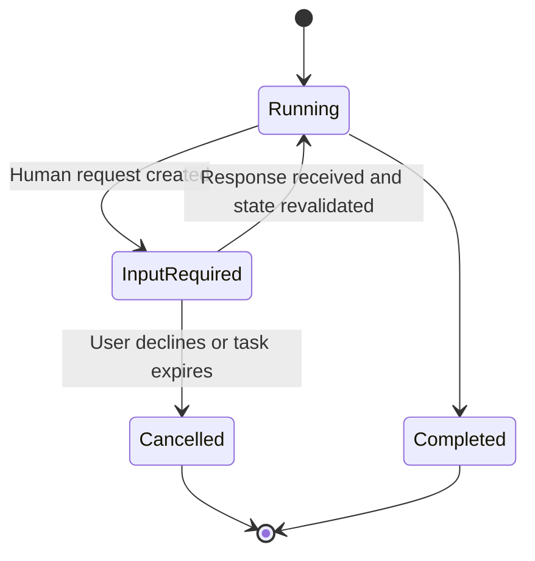

## Disclaimer

These are my personal observations and opinions.

## Background

In the previous post, I asked where an agent's capabilities should live. Skills package information. Remote tools expose bounded capabilities. Code-as-tool gives an agent a flexible execution environment. Each choice places information, computation, credentials, and state in a different part of the system.

But some capabilities cannot—or should not—be transferred to a skill, tool, or runtime.

The user may know something that is not written anywhere. An operation may require physical access, personal authentication, or a permission the agent should never receive. The output may require subjective judgment that cannot be reduced to a test. A consequential action may need explicit human authorization.

When the agent reaches one of these boundaries, it asks a human.

Human-in-the-loop is usually discussed from the system designer's perspective: Where should we insert review, approval, or intervention into an automated process? I want to reverse the perspective. From the agent's local operational view, a human can look surprisingly similar to a tool. The agent identifies a missing capability, sends a request, waits for a result, and uses that result to continue the task.

This leads to a deliberately provocative mental model:

> Human as a tool.

I do not mean that a person is merely a resource for an agent to consume, or that an agent has an independent purpose to which the human should be subordinated. The task ultimately exists for a person or an organization. The metaphor is useful because it forces us to design the interaction as carefully as any other capability boundary. It is incomplete because the human also owns, changes, and can terminate the goal.

That tension is the subject of this post.

## Reversing Human-in-the-Loop

Traditional human-in-the-loop design starts from the system:

- Where must a person review the agent's work?
- Which operations require approval?
- When should automation stop?
- How can a person correct the system?

The human is inserted into the loop as a control mechanism.

Human-as-a-tool starts from the agent's current task state:

- What is missing?
- Why can the agent not obtain it independently?
- What does it need a person to provide or do?
- What result will allow the task to continue?

The human is requested as a capability.

```text
Human-in-the-loop:
System -> inserts human control into agent execution

Human-as-a-tool:
Agent -> requests a human capability to continue execution
```

The same interaction can be both.

Imagine an agent preparing to publish a generated report. From the agent's perspective, asking the user to approve publication is a request for missing authorization. From the system's perspective, the approval is a safety gate. From the user's perspective, it is the point at which they retain control over an external consequence.

These perspectives are compatible, but they emphasize different design questions. Human-in-the-loop asks where control should be placed. Human-as-a-tool asks how the request should be made and how the loop should continue afterward.

## Four Capabilities That Remain Human

In practice, I find that agents ask humans for four different kinds of capability: information, action, judgment, and authority.

They are often presented through the same chat interface, but they should not be treated as the same operation.

### Human as a Sensor: Information

An agent can inspect files, search documentation, query databases, and call remote tools. But some information exists only in a person's head or current surroundings.

The user may need to explain:

- what they are ultimately trying to achieve;
- what an ambiguous term means in their organization;
- which of several valid outcomes they prefer;
- whether an undocumented assumption is true;
- what is happening in a physical or inaccessible environment;
- which private context is relevant to the task.

In this role, the human acts as a sensor for information the system cannot observe directly.

This does not mean the agent should ask the user whenever it is uncertain. Often the information already exists in the environment and should be discovered through tools. Sometimes a low-risk assumption is sufficient. Human input becomes necessary when the missing information is genuinely private, tacit, ambiguous, or unavailable through other authorized channels.

The distinction matters because asking too early transfers exploration work from the agent back to the user. A coding agent should usually inspect the repository before asking where a file is. A domain assistant should search available definitions before asking the user to reproduce them. But no amount of repository search can discover a preference the user has not expressed.

### Human as an Actuator: Action

Sometimes the agent knows what needs to happen but cannot perform the action itself.

The operation may require a person to:

- complete interactive authentication;
- operate an application without an accessible API;
- connect or inspect a physical device;
- perform a step in a restricted environment;
- make a phone call or complete an offline process;
- use a permission that should remain personal.

In control systems, an actuator changes the state of the environment. In an agent workflow, the human sometimes plays this role by connecting the digital loop to an environment the agent cannot reach.

An action request should be different from a vague instruction such as "please fix the environment." The agent should explain the exact operation, why it is necessary, what the expected result looks like, and how the system will verify that the state has changed.

This last point is important. A user saying "done" is not always sufficient evidence that the environment now matches the agent's assumptions. If the system can safely verify the result, it should. Human action may change the world, but the agent still needs to observe the new state before continuing.

### Human as a Judge: Feedback

Some outputs can be verified automatically. Code compiles or it does not. A schema matches or it does not. A test passes or it does not.

Other outputs require judgment:

- Does this explanation sound natural?
- Does the design reflect the intended trade-off?
- Is the report useful to its audience?
- Is the result good enough for the current purpose?
- Which of two reasonable alternatives is preferable?

In this role, the human evaluates qualities that have not been fully formalized as rules.

This is different from asking the user to do testing that the agent could have performed. Human judgment is most valuable where the evaluation depends on taste, intent, context, or a trade-off that belongs to the user. It should not become a substitute for missing automated verification.

The difference can be expressed simply:

```text
Verification asks: Did the output satisfy an explicit condition?
Evaluation asks: Is this the outcome we actually want?
```

Both matter, but they belong to different parts of the loop.

### Human as an Authority: Permission and Direction

The fourth role is fundamentally different from the first three.

Information, action, and judgment provide capabilities that help the agent continue. Authority determines whether it should continue, and under which goal.

A person may need to:

- approve an irreversible operation;
- accept a material risk;
- authorize access to a protected resource;
- commit money, time, or organizational resources;
- choose between goals with different consequences;
- pause, redirect, or terminate the task.

This authority should not be treated as missing data that the agent merely needs to retrieve. It represents ownership of the decision.

An agent may recommend an action and explain the evidence. A system may structure the choices. But the approval should remain meaningful: the user needs to understand what is being authorized, and declining must remain a real option.

> Information, action, and judgment may help the agent continue the loop. Authority determines whether the loop should continue at all.

## Asking a Human Is Not One Generic Tool

Many agent systems represent all four roles through one generic behavior: ask the user a question. This is convenient at the interface level but weak at the system level.

Consider the difference between these requests:

```text
What reporting period should I use?          Information
Please complete the login in your browser.  Action
Which version reads more naturally?          Judgment
May I publish this report externally?        Authority
```

They expect different responses and carry different consequences. A natural-language answer may satisfy an information request. An action request needs an observable state change. A judgment request may need alternatives to compare. An authorization request needs a clear description of scope and consequence.

A useful human request should make several things explicit:

- **Request type:** information, action, judgment, or authorization;
- **Reason:** why the agent cannot continue safely or correctly without it;
- **Evidence:** what the agent has already inspected or attempted;
- **Expected response:** what the person needs to provide or do;
- **Consequence:** what the agent will do with the response;
- **Blocking status:** whether other useful work can continue while waiting.

This is similar to designing a software tool schema. The request should expose the minimum structure necessary for both sides to understand the interaction. But unlike a software schema, it must also respect that a person can reinterpret the question, challenge its premise, provide an unexpected alternative, or refuse entirely.

### A Human-Request Tool with MCP Apps

One practical implementation is to expose a tool that lets the agent create a structured request for a person. The tool input can include the question, why it is needed, the expected response options, and any steps the person needs to perform.

The [MCP Apps extension](https://modelcontextprotocol.io/extensions/apps/overview) makes the presentation side of this design portable. MCP Apps allow a tool to reference a predeclared interactive UI resource. A simplified tool definition could look like this:

```json
{
  "name": "request_human_input",
  "inputSchema": {
    "type": "object",
    "properties": {
      "request_type": { "type": "string" },
      "question": { "type": "string" },
      "reason": { "type": "string" },
      "steps": { "type": "array" },
      "response": { "type": "object" }
    }
  },
  "_meta": {
    "ui": {
      "resourceUri": "ui://human-request/form"
    }
  }
}
```

The agent supplies request data, not executable UI. For example, an agent that cannot run validation inside the user's configured environment might provide:

```json
{
  "request_type": "action",
  "question": "Please run the generated validation script in the configured environment.",
  "reason": "I can inspect the files, but I cannot execute with the required dependencies.",
  "steps": [
    "Open the project terminal.",
    "Run ./validate-output.sh.",
    "Attach the error output if it fails."
  ],
  "response": {
    "options": ["passed", "failed", "cannot_run"],
    "allow_notes": true,
    "allow_attachment": true
  },
  "blocking": true
}
```

The client does not need to show this as raw JSON or convert it into an ordinary chat message. If it supports MCP Apps, it can load the predeclared `ui://human-request/form` resource in a sandboxed view. The question and reason become explanatory text, the steps become a checklist, the options become buttons, and the person can add notes or attach the requested evidence.

Keeping the UI template separate from the agent-generated data is an important safety property. The server defines and declares the application. The host can inspect and sandbox it. The agent fills a bounded request schema rather than generating arbitrary HTML that the client is expected to trust.

MCP Apps is not the only relevant MCP capability. For a simple question or selection, [MCP Elicitation](https://modelcontextprotocol.io/specification/2025-11-25/client/elicitation) may be sufficient. An `elicitation/create` request can define a small form through a restricted JSON Schema, and the response explicitly distinguishes `accept`, `decline`, and `cancel`. This maps well to information requests, simple choices, and confirmations.

MCP Apps becomes useful when the interaction needs more than a basic generated form: a checklist, dependent fields, attachments, an artifact preview, or a multi-step review experience. The App can communicate with the host, call server tools, and update model context, while remaining isolated in a sandboxed iframe.

Neither Elicitation nor MCP Apps, by itself, makes the waiting workflow durable. The UI may collect the response, but something still needs to preserve the suspended task. The experimental [MCP Tasks capability](https://modelcontextprotocol.io/extensions/tasks/overview) provides a useful protocol model: a long-running task can move from `working` to `input_required`, expose the outstanding request, and return to `working` after the client supplies a response.

The complete design therefore has several layers:

| Responsibility | Possible mechanism |
|---|---|
| Describe the requested input | Tool schema or MCP Elicitation |
| Present a rich interaction | MCP Apps |
| Pause and resume the operation | MCP Tasks or a workflow engine |
| Preserve domain artifacts and session state | Database, Redis, object storage, or local files |
| Enforce authorization policy | Trusted host and server logic |

The resulting flow is:

```text
Agent creates human-request data
        -> Server validates and persists the request
        -> MCP App renders an interactive form
        -> Task or workflow enters input_required
        -> Human submits, declines, cancels, or corrects the request
        -> Response is associated with the durable task/request ID
        -> Workflow restores state, revalidates the environment, and resumes
```

This turns a conversational interruption into a typed workflow transition. It also makes the request observable: the system knows why the task paused, which response it is waiting for, and what should happen when the response arrives.

The form should not force the user into the agent's expected answers. A free-text correction, an alternative action, and refusal should remain possible when appropriate. The options help the client structure common responses; they do not define the limits of human judgment.

Authorization requires an additional safeguard. For a high-impact action, the client should render the actual operation, target, and consequence from trusted system state—not only from the agent's generated description. Otherwise, an inaccurate or biased summary could turn a visually polished approval form into false assurance.

## Human Attention Is Expensive

Asking the user is sometimes treated as the safest default. When uncertain, stop and ask. This can prevent a wrong assumption, but it can also produce an agent that transfers every difficult decision back to the person it is supposed to help.

Human attention is not a free fallback.

Compared with a software tool call, a human request has unusual properties:

| Property | Software tool | Human |
|---|---|---|
| Latency | Usually seconds | Minutes, hours, or days |
| Availability | Often predictable | Uncertain |
| Output format | Structured | Variable |
| Retry cost | Usually low | Consumes more attention |
| Context | Supplied programmatically | May need to be reconstructed |
| Refusal | Error or permission denial | Independent decision |
| Interruption cost | None | Potentially high |

A poorly designed tool call wastes compute or tokens. A poorly designed human call interrupts someone, asks them to reconstruct context, and may leave them responsible for a decision the system could have made safely.

Repeated requests also create confirmation fatigue. If an agent asks for approval too often, the user may stop reading and approve mechanically. Adding more human checkpoints can therefore make a system appear safer while making each checkpoint less meaningful.

This leads to a different optimization target:

> A human request should be optimized for information gain and decision value, not merely for convenience to the agent.

The best human call is not necessarily the shortest question. It is the request that gives the person enough context to respond once, without requiring them to reconstruct the entire task or enter a long clarification loop.

## When Should the Agent Ask?

An agent should not choose between "act autonomously" and "ask the user" as if these were the only options. It can first discover information, make an explicit low-risk assumption, continue non-blocking work, or narrow the question.

A useful order is:

```text
Can the agent discover the answer through authorized resources?
        |
        | No
        v
Can it make a reversible, low-risk assumption and state it clearly?
        |
        | No
        v
Can it continue other useful work while narrowing the uncertainty?
        |
        | No
        v
Ask the human
```

Several factors affect this decision.

### Uncertainty

How uncertain is the agent, and what exactly is uncertain? A vague feeling that more context might help is not enough. The agent should identify the missing fact, preference, action, judgment, or permission.

### Consequence

What happens if the agent is wrong? A formatting preference and a production data deletion should not use the same threshold for asking.

### Reversibility

Can the action be undone easily? Reversible changes allow the agent to make more progress with explicit assumptions. Irreversible actions require stronger evidence and often human authority.

### Cost of Interruption

Is the request blocking, and does it justify the user's attention now? Several related questions may be grouped into one coherent request. A non-blocking preference can sometimes wait until the agent has produced something concrete to evaluate.

### Ownership

Does the decision belong to the agent's implementation freedom, or to the user's goals and risk tolerance? The agent should not ask the user to choose between two internal library functions merely because it is uncertain. It should ask when the choice changes an outcome the user cares about.

A practical rule is:

> Discover what can be discovered. Infer what is safe and reversible. Ask for what is private, consequential, or owned by the human.

## A Human Call Makes the Loop Asynchronous

Most software tools return within seconds. A human may respond minutes, hours, or days later.

This changes the architecture of the loop. The system cannot simply pause an in-memory process and assume that the world will remain unchanged. It needs to persist the task, release resources, associate the future response with the correct request, and restore enough context to continue. MCP Tasks gives this lifecycle a protocol-level representation, but the application still owns the domain state and recovery policy.



The waiting state may need to preserve:

- the current task and workflow stage;
- the exact human request;
- why the request was necessary;
- artifacts and evidence collected so far;
- what work can resume after the response;
- the environment assumptions that may need revalidation;
- timeout, reminder, and cancellation policy.

When a response arrives, the agent should not blindly continue from an old plan. The repository may have changed. A remote resource may have been updated. A permission may have expired. Another actor may have completed or invalidated part of the task.

Human-in-the-loop therefore requires more than an `ask_user()` function. It requires suspension, persistence, notification, resumption, and revalidation.

This is also where state placement from the previous posts becomes concrete. A local interactive task may preserve its request in project files. A cross-device or long-running workflow may need remote session state. The longer the expected human latency, the less safe it is to rely only on transient conversation context.

## Feedback Is Not Approval

Human responses are often ambiguous. A short phrase such as "looks good" may mean:

- the content is directionally correct;
- the user prefers this version;
- the agent may continue editing;
- the artifact is approved for internal use;
- the artifact is authorized for external publication.

These meanings are not equivalent.

Agent systems should distinguish at least the following:

- **Information:** a fact, intent, or preference;
- **Feedback:** an evaluation of the current output;
- **Correction:** evidence that an assumption or result is wrong;
- **Approval:** permission to proceed with a specified action;
- **Authorization:** a grant of access or power the system did not previously have;
- **Goal change:** a modification of what the task is trying to achieve.

The more consequential the interpretation, the less the system should infer from an ambiguous response. Positive feedback on a draft is not automatically permission to publish it. Helping the agent choose an implementation is not automatically acceptance of every operational risk.

This is another reason human requests need explicit types and consequences. The system should know whether it is asking "Is this useful?" or "May I send this?" The user should know too.

## The Limit of the Human-as-a-Tool Metaphor

The human-as-a-tool metaphor is useful at the implementation level.

It encourages us to define trigger conditions, request types, expected results, state transitions, timeouts, and recovery. It reveals that asking a person is a capability call with latency and cost. It helps explain how a long-running agent can suspend a task and resume when missing information or action arrives.

But the metaphor becomes dangerous if it is treated as a complete model of the system.

A software tool has no independent goal. It does not care whether it is interrupted. It cannot challenge the purpose of the task. It does not own the consequences of the action. A person can do all of these things.

The agent should not manipulate the user into providing the response that best advances its current plan. It should not hide uncertainty to make approval easier. It should not frame refusal as an error to be worked around. It should not optimize task completion at the expense of meaningful human control.

The direction of service also matters. The human does not exist to help the agent complete its objective. The agent exists to help accomplish a human or organizational objective. What looks locally like the agent "using" a person is globally the system returning to the owner of the task for information, action, judgment, or authority.

> Human-as-a-tool is a useful implementation model, but an incomplete governance model.

From the agent's local perspective, the human may look like a callable capability. From the system's perspective, the human remains the owner of the goal.

## Conclusion

Human-in-the-loop is often reduced to an approval button placed before a risky action. That is only one form of human involvement.

Agents depend on people in several ways. A human can provide information the system cannot observe, perform an action the agent cannot execute, evaluate an outcome that cannot be fully formalized, or exercise authority that should not be delegated.

Seeing these interactions as human tool calls helps make them engineerable. The system can distinguish request types, minimize unnecessary interruptions, preserve state while waiting, and resume from a clear continuation point.

But the most important design principle comes from the limit of the analogy.

Human attention is expensive. Human judgment is independent. Human approval must be meaningful. Human refusal is not a tool failure. And human authority exists not merely inside the loop, but over it.

> The human can be modeled as a tool when the agent needs information, action, or judgment. But the system must never forget that the human is also the person for whom the loop exists.
